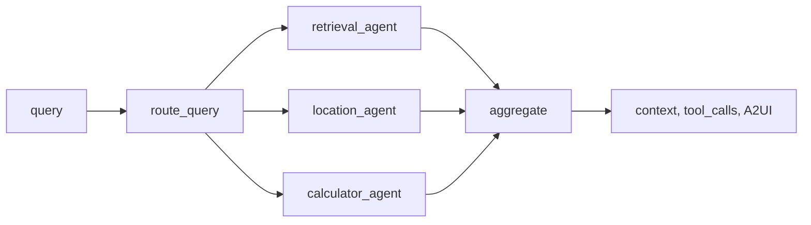
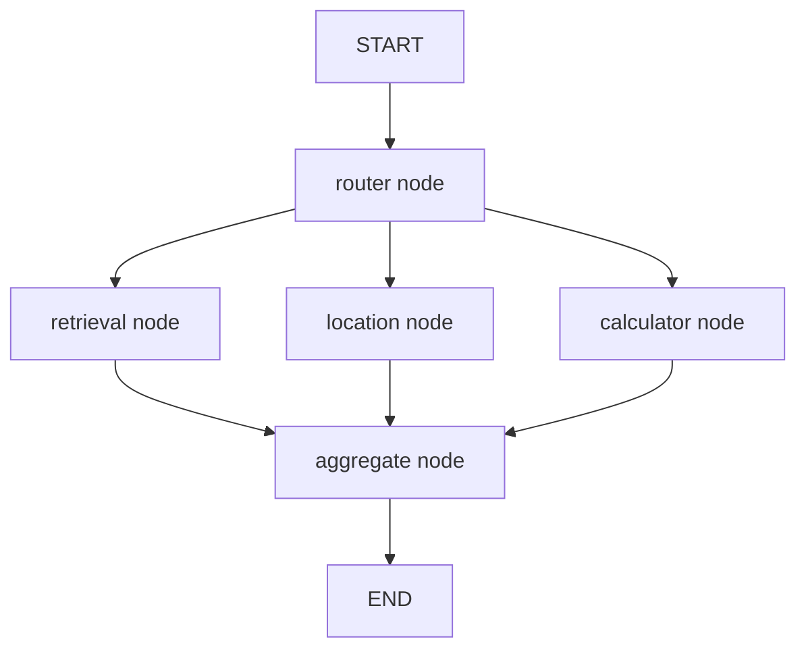

# Agentic frameworks, LangGraph, and AI workflow orchestration: plan and concepts

This document is a **plan and concept reference** only—no code is executed. It (1) defines basic **agentic frameworks** and **AI workflow orchestration** concepts, (2) introduces **LangGraph** and how it fits, (3) summarizes what this repo already has, and (4) gives a concrete plan to implement or extend LangGraph-based orchestration.

**Related docs:** [lib/agents.py](lib/agents.py) (current orchestrator), [docs/ARCHITECTURE.md](docs/ARCHITECTURE.md) (Phase 4 agents flow), [PHASES.md](PHASES.md) (Phase 4 tests).

---

## 1. Scope and objectives

| Objective | Description |
|-----------|-------------|
| **Concepts** | Define agentic systems, workflow orchestration, and how LangGraph models multi-step, stateful AI workflows. |
| **Current state** | Document existing orchestration in this repo (custom orchestrator, LangChain tool-calling agent). |
| **Plan** | Add or document a **LangGraph**-based workflow as an alternative path; keep implementation optional and dependency clearly scoped. |

---

## 2. Agentic frameworks and orchestration: concepts

### 2.1 What is an “agentic” system?

- **Agent:** A component that can use **tools** (APIs, retrieval, calculators) and **reason** over multiple steps to achieve a goal. The agent may decide which tool to call, in what order, and when to stop.
- **Agentic framework:** A library or pattern that supports building such agents—e.g. **tool-calling** (LLM chooses tools and arguments), **multi-agent** (several specialists + router), or **graph-based workflows** (explicit states and transitions).

### 2.2 AI workflow orchestration

- **Orchestration:** Coordinating multiple steps (retrieval, tool calls, LLM calls, conditionals, loops) in a defined or adaptive order.
- **Workflow:** A directed flow of steps; may be linear (A → B → C) or branching (router → specialist A or B) or cyclic (e.g. “retrieve → grade → maybe retrieve again”).
- **State:** Data passed between steps (e.g. current query, collected context, tool results, messages). Orchestration often implies **explicit state** and **transitions** between nodes.

### 2.3 Why use a graph / state machine?

- **Clarity:** The workflow is visible as a graph (nodes = steps, edges = transitions) instead of buried in imperative code.
- **Control flow:** Conditional edges (e.g. “if need_more_context then retrieve again else answer”) and cycles (e.g. ReAct-style loops) are first-class.
- **Persistence and debugging:** If the framework supports **checkpointing**, state can be saved and resumed (e.g. for human-in-the-loop or replay).
- **Reuse:** The same graph can be run with different LLMs or tools by swapping bindings.

---

## 3. LangGraph in brief

### 3.1 What is LangGraph?

- **LangGraph** (from LangChain) extends LangChain with **stateful, graph-based** workflows. The workflow is a **StateGraph**: nodes are functions that read and update a shared **state**, and edges define transitions (including **conditional edges** that choose the next node from the state).
- **Concepts:**
  - **State:** A typed schema (e.g. `TypedDict`) holding `messages`, `context`, `tool_results`, `next_step`, etc. Each node receives the current state and returns updates (merged into the state).
  - **Nodes:** Python functions (or runnables) that take state in and return state updates (e.g. “retrieval” node, “calculator” node, “LLM” node).
  - **Edges:**  
    - **Fixed:** from node A to node B.  
    - **Conditional:** from node A to a function that inspects state and returns the next node name (e.g. “retrieve_again” vs “generate”).
  - **Entry / end:** One or more entry points (e.g. `START`) and one or more end nodes (e.g. `END`).
  - **Cycles:** The graph can loop (e.g. retrieve → grade → if not good enough, back to retrieve).
  - **Checkpointer (optional):** Persists state at each step so the run can be resumed or inspected; useful for human-in-the-loop or debugging.

### 3.2 Typical patterns for RAG / multi-tool apps

- **Simple pipeline:** `START → router → [retrieval | location | calculator] → aggregate → LLM → END`.
- **ReAct-style:** `START → LLM (decide tool) → tool_execution → back to LLM → … → END` when LLM says “finish”.
- **Agent supervisor:** One “supervisor” node (LLM) that decides which specialist to call; specialists are nodes; control returns to supervisor after each specialist.

### 3.3 Relation to this project

- The current **custom orchestrator** (`lib/agents.py`) is a **fixed pipeline**: `route_query` (keyword-based) → invoke specialists in order → aggregate → caller runs LLM. No cycles, no conditional “retrieve again,” no persisted state.
- **LangGraph** would allow the same specialists to be **nodes** in a graph, with optional **conditional routing** (e.g. LLM-based “which specialist?”) and **cycles** (e.g. “need more context” → retrieval again). A2UI directives and tool_calls can remain part of the state and be returned at the end.

---

## 4. Current state in this repository

### 4.1 Custom orchestrator (`lib/agents.py`)

| Aspect | Implementation |
|--------|----------------|
| **Routing** | `route_query(query)` — keyword-based; returns list of specialist names (retrieval_agent, location_agent, calculator_agent). |
| **Execution** | `run_orchestrator(query, retrieval_fn, location_fn, calculator_fn)` — calls each selected specialist in order, aggregates context and tool_calls, returns A2UI directives (e.g. show_map, show_calculator). |
| **State** | No explicit state object; results accumulated in lists and joined. |
| **Cycles / conditionals** | None; single pass. |
| **Used in** | `app.py` when “Use Phase 4 agents” is enabled; orchestrator runs then LLM is called with combined context. |

### 4.2 LangChain tool-calling agent (`app_RAG_ollama_langchain.py`)

| Aspect | Implementation |
|--------|----------------|
| **Pattern** | Single agent with tools; `create_tool_calling_agent` + `AgentExecutor`; LLM chooses which tool to call and with what arguments. |
| **Orchestration** | LangChain’s built-in ReAct/tool-calling loop (agent → tool → agent → … until done). Not a separate “orchestrator” graph. |
| **Relation to LangGraph** | Different style (tool-calling loop vs explicit graph); LangGraph can implement similar flows with explicit nodes and state. |

### 4.3 Gaps relative to “LangGraph and workflow orchestration”

- **No LangGraph dependency:** `requirements.txt` has `# langgraph>=0.0.20` commented out; no LangGraph code in the repo.
- **No graph abstraction:** Orchestration is procedural (function calls in sequence), not a declared graph with nodes and edges.
- **No conditional/cyclic workflow:** e.g. “retrieve → grade relevance → if low, retrieve again” would require adding a LangGraph (or similar) graph.
- **No checkpointing:** No persisted state for resume or human-in-the-loop.

---

## 5. Plan to implement LangGraph and workflow orchestration (no code run)

### 5.1 Add concepts and glossary to the repo

- **In this file (or a short `docs/AGENTIC_ORCHESTRATION.md`):** Keep §2–3 as the **concepts** reference (agentic systems, orchestration, state, LangGraph nodes/edges/state/checkpointer). Add a one-page diagram (e.g. Mermaid) of “current orchestrator” vs “LangGraph-style graph” so the difference is clear.
- **In README or ARCHITECTURE:** Add one sentence that Phase 4 supports “custom orchestrator (keyword routing)” and “optional LangGraph workflow (see agentic_frameworks_langgraph_plan.md).”

### 5.2 Design a LangGraph workflow for this app

- **State schema (to implement later):** Define a `TypedDict` (or Pydantic) with at least: `query`, `messages`, `context`, `tool_calls`, `a2ui_directives`, `specialists_invoked`, `next_step` (optional). Match current orchestrator output shape so the rest of the app (e.g. `app.py`) can stay the same.
- **Nodes (to implement later):**
  - **Router:** Input state with `query`; output state with `next_step` = one or more of `retrieval`, `location`, `calculator`. Can be keyword-based (like current `route_query`) or an LLM call.
  - **Retrieval:** Calls existing retrieval_fn (vector/hybrid); updates state `context`, `tool_calls`.
  - **Location:** Calls location_fn; updates state `context`, `tool_calls`, and e.g. `a2ui_directives` with `show_map`.
  - **Calculator:** Calls calculator_fn; updates state `context`, `tool_calls`, `a2ui_directives` with `show_calculator`.
  - **Aggregate:** Merges context from all invoked specialists; optional “LLM generate” node that produces final answer from state (or keep final generation in `app.py` as today).
- **Edges:**
  - **START → Router.**
  - **Router →** conditional edge to Retrieval, Location, and/or Calculator (e.g. parallel branches or a single “invoke_selected” node that calls each selected specialist).
  - **Retrieval, Location, Calculator → Aggregate.**
  - **Aggregate → END.**
- **Optional cycle (later):** Add a “grade_context” node and conditional edge “if score low → Router or Retrieval again else Aggregate”; requires defining a simple scoring step.

### 5.3 Integration with existing code

- **Dependency:** Uncomment and pin `langgraph` in `requirements.txt` only when implementing the LangGraph path; document in this plan that it’s optional and used only when “Use LangGraph” (or similar) is enabled.
- **Entry point:** Add a thin wrapper in `lib/agents.py` (e.g. `run_orchestrator_langgraph(...)`) that builds the graph, invokes it with the same `retrieval_fn`, `location_fn`, `calculator_fn`, and returns the same shape as `run_orchestrator`: `(combined_context, tool_calls, a2ui_directives, specialists_invoked)`. This keeps `app.py` unchanged except for a switch (e.g. sidebar “Use LangGraph” vs “Use classic orchestrator”).
- **A2UI and MCP:** Keep A2UI directives and tool_calls in the graph state and in the return value; MCP tools can be exposed as additional nodes or as tools called from an “LLM tool” node inside the graph later.

### 5.4 Documentation and tests

- **API.md:** Document `run_orchestrator` and (when added) `run_orchestrator_langgraph`; describe that the latter uses a LangGraph StateGraph with router and specialist nodes.
- **ARCHITECTURE.md:** Add a subsection “Phase 4 agents: LangGraph option” with a Mermaid diagram of the graph (nodes and edges).
- **Tests:** Plan a small test that builds the graph and runs it with mock retrieval/location/calculator fns and asserts on the shape of the returned context and tool_calls (no need to run real LLM or Qdrant).

### 5.5 Optional extensions (later)

- **Checkpointer:** Add an in-memory (or Redis) checkpointer to the graph so runs can be resumed; document use case (e.g. human-in-the-loop or debugging).
- **Human-in-the-loop:** Add a node that pauses for approval (e.g. “run location?”) when configured; LangGraph supports interrupt before a node.
- **LLM-based router:** Replace keyword router node with an LLM call that returns which specialists to invoke; keep state shape the same.

---

## 6. Implementation order (suggested)

1. **Documentation only:** Finalize this plan; add “Current vs LangGraph” diagram; add one paragraph to README and ARCHITECTURE pointing to this file.
2. **State schema:** Define the state TypedDict (or Pydantic) and document it in this file and in API.md.
3. **Graph design:** Write (on paper or in comments) the exact nodes and edges; add Mermaid to ARCHITECTURE and this file.
4. **Implement graph:** Add `langgraph` to requirements (optional extra or behind a flag); implement graph in a new module (e.g. `lib/agents_graph.py`) or inside `lib/agents.py`; implement `run_orchestrator_langgraph` returning same shape as `run_orchestrator`.
5. **Wire in app:** Add sidebar option “Use LangGraph” and call `run_orchestrator_langgraph` when enabled; keep classic orchestrator as default.
6. **Test:** Add unit test with mocks; optionally add a Phase 4 test in PHASES.md that requires “LangGraph path returns valid context and tool_calls.”
7. **Optional:** Checkpointer, human-in-the-loop, or LLM router as above.

---

## 7. Diagram: current orchestrator vs LangGraph-style

### 7.1 Current (lib/agents.py)

Single pass; keyword routing; no cycles; no explicit state object.

### 7.2 LangGraph-style (target)

State flows through each node; router can be conditional (keyword or LLM); optional cycle: AGG → grade → ROUTER or RET. Same external interface: (context, tool_calls, a2ui_directives, specialists).

---

## 8. Summary

| Item | Status / plan |
|------|----------------|
| **Concepts** | Defined in §2–3 (agentic, orchestration, state, LangGraph nodes/edges/state/checkpointer). |
| **Current repo** | Custom orchestrator in `lib/agents.py`; LangChain tool-calling in `app_RAG_ollama_langchain.py`; no LangGraph. |
| **LangGraph** | Not yet implemented; plan: optional dependency, new graph (router → specialists → aggregate), same return shape as orchestrator. |
| **Documentation** | This file + diagram; link from README/ARCHITECTURE; API.md and ARCHITECTURE updated when graph is added. |
| **Tests** | Plan: unit test with mocks for graph invocation and return shape. |

---

*This document is for planning and concepts only; no code has been run or modified as part of this file.*
