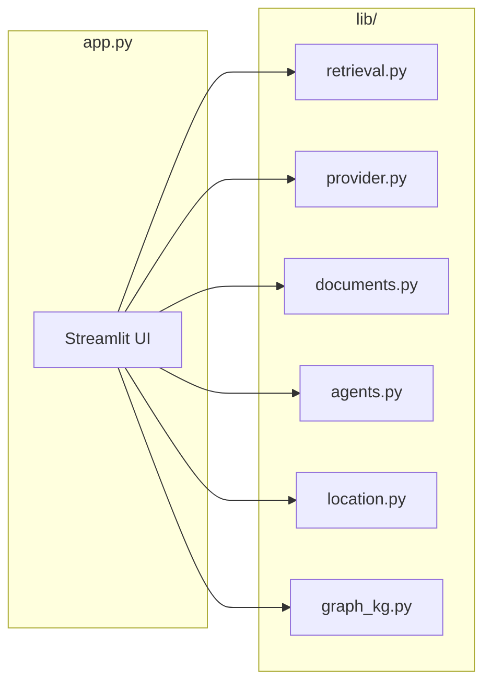

# API & Tools Documentation

This document describes the programmatic interfaces and “tools” used by the Expat NL Mortgage RAG app: Python APIs in `lib/`, scripts, and external services. The app is Streamlit-based; there is no REST API exposed by the app itself unless you add one (see [CODE_TODO.md](../CODE_TODO.md)).

---

## 1. Overview

---

## 2. Retrieval (`lib/retrieval.py`)

### `vector_search(qdrant_client, collection_name, query_vector, limit=10, query_text="")`
- **Returns**: `(chunks, tool_calls)`  
- **chunks**: list of `{ "text", "source", "score" }`  
- **tool_calls**: list of `{ "tool": "vector_search", "args": { "query", "limit" } }`  
- **Usage**: Pure vector similarity search in Qdrant.

### `hybrid_retrieve(qdrant_client, collection_name, query_vector, query_text, limit=10, vector_limit=None, rrf_k=60)`
- **Returns**: `(chunks, tool_calls)`  
- **Behavior**: Vector search with `vector_limit` (default 2× limit), then keyword re-rank (query terms in text), then RRF merge.  
- **tool_calls**: `{ "tool": "hybrid_retrieve", "args": { "query", "limit" } }`

---

## 3. Provider (`lib/provider.py`)

### `get_available_llm_providers() -> list[str]`
- Returns provider names enabled by `.env` (e.g. `["openai", "openrouter", "ollama"]`).

### `get_default_llm_models(provider: str) -> list[str]`
- Returns model list for the given provider (from `.env` or built-in defaults).

### `get_llm_client(provider_override: str | None = None) -> OpenAI`
- Returns OpenAI-compatible client for chat.  
- **Raises** `RuntimeError` for missing API key or if provider is `ollama` (use Ollama URL in app instead).

### `get_embedding_client() -> OpenAI`
- Returns OpenAI-compatible client for embeddings (uses `EMBEDDING_PROVIDER` and corresponding key).

---

## 4. Documents (`lib/documents.py`)

### `list_documents_in_store(qdrant_client, collection_name) -> list[dict]`
- **Returns**: `[{ "source": str, "chunk_count": int }, ...]`  
- Scrolls the collection and aggregates by `payload["source"]`.

### `extract_text_from_pdf_bytes(data: bytes) -> str`
- Extracts raw text from PDF bytes (pypdf).

### `chunk_text_simple(text, chunk_size=800, overlap=150) -> list[str]`
- Simple overlapping text chunking (aligned with ingestion defaults).

### `upsert_pdf_to_qdrant(qdrant_client, embedding_client, collection_name, file_name, file_bytes, chunk_size=800, overlap=150, ...) -> int`
- Extracts text, chunks, embeds, deletes existing points for `source=file_name`, upserts new points.  
- **Returns**: number of chunks inserted.  
- **Optional kwargs**: `embedding_model`, `vector_dimension`.

---

## 5. Agents (`lib/agents.py`)

### `route_query(query: str) -> list[str]`
- **Returns**: list of specialist names to invoke: `retrieval_agent`, `location_agent`, `calculator_agent`.  
- Logic: keyword-based routing (e.g. “near”, “mortgage”, “calculate” → location, retrieval, calculator).

### `run_orchestrator(query, retrieval_fn, location_fn, calculator_fn) -> tuple[str, list[dict], list[dict], list[str]]`
- **Returns**: `(combined_context, tool_calls, a2ui_directives, specialists_invoked)`.  
- Each `*_fn(query)` returns `(context_str, tool_calls)`.  
- **a2ui_directives**: e.g. `[{ "type": "show_map", "payload": {} }]`.

---

## 6. Location (`lib/location.py`)

### `nearby_places(address: str, ...) -> tuple[list[dict] | None, list[dict]]`
- Geocodes address (Nominatim), fetches nearby POIs (Overpass), returns `(results, tool_calls)`.

### `osrm_commute(origin: str, destination: str, ...) -> tuple[dict | None, list[dict]]`
- Returns route info (distance, duration) and tool_calls (e.g. for “Tools Used”).

### `area_safety(area_name: str, ...) -> tuple[dict | None, list[dict]]`
- Placeholder/sample for safety by area; returns structure and tool_calls.

### `nearby_pois_with_routes(address, categories, profile="car", ...)`
- POIs by category with OSRM route; used by Map tab.

---

## 7. Knowledge graph (`lib/graph_kg.py`)

### `extract_entities_relations_simple(text: str) -> tuple[list[dict], list[dict]]`
- **Returns**: `(nodes, edges)` for entity/relation extraction (rule-based).

### `build_kg_from_text(text: str) -> str`
- Runs extraction and returns PyVis HTML string (for embedding in Streamlit).

---

## 8. Scripts (CLI)

| Script | Purpose | Key args |
|--------|---------|----------|
| `scripts/ingest_docs.py` | Ingest PDFs into Qdrant | `--docs-dir`, `--no-replace`, `--semantic` |
| `scripts/test_ingestion.py` | Verify Qdrant and collection | (none) |
| `scripts/test_phase2.py` | Phase 2 checks (Neo4j, graph) | `--check-neo4j` |
| `scripts/run_ragas.py` | RAG evals on golden set | `--dataset`, `--output` |
| `scripts/metrics_server.py` | Prometheus /metrics server | (env: `METRICS_PORT`) |

---

## 9. External services

| Service | Use | Env / config |
|---------|-----|-------------|
| **Qdrant** | Vector store | `QDRANT_URL`, `QDRANT_COLLECTION`, optional `QDRANT_API_KEY` |
| **OpenAI / OpenRouter** | LLM + embeddings | `OPENAI_API_KEY` / `OPENROUTER_API_KEY`, `LLM_PROVIDER`, `EMBEDDING_PROVIDER` |
| **Ollama** | Local LLM (chat only) | `OLLAMA_URL` |
| **Tavily** | Web search | `TAVILY_API_KEY` |
| **Nominatim / Overpass / OSRM** | Geocoding, POIs, routes | Default public endpoints; override via env if self-hosted |
| **Langfuse** | Observability | `LANGFUSE_*` |
| **Prometheus** | Metrics scrape | `scripts/metrics_server.py` on `METRICS_PORT` (default 9090) |

---

## 10. App entry point

- **Run**: `streamlit run app.py`  
- **Config**: `.env` (see `.env.example` and [DEPLOYMENT.md](../DEPLOYMENT.md)).  
- No REST API is exposed by the Streamlit app; all “API” usage is via Python imports from `lib/` and scripts.

For adding a proper backend API (e.g. FastAPI) and separating frontend/backend, see [CODE_TODO.md](../CODE_TODO.md).
