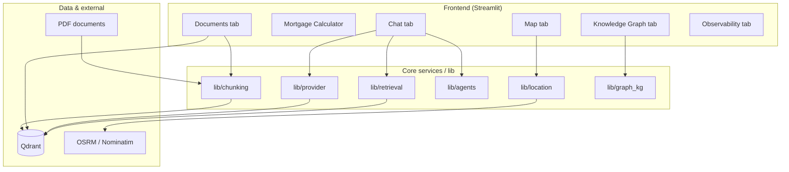
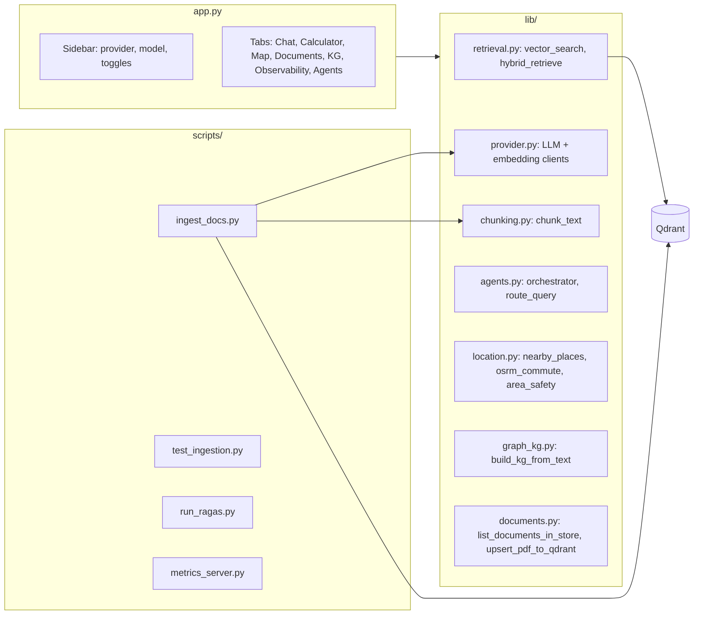
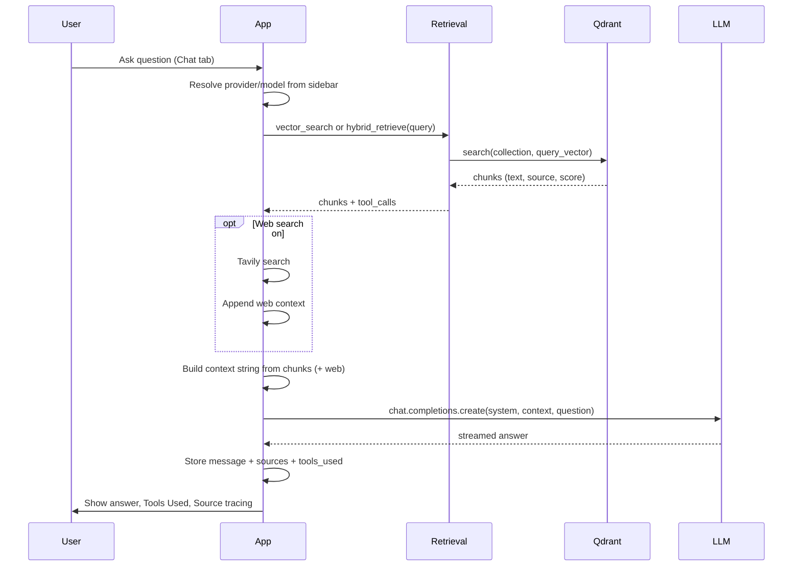
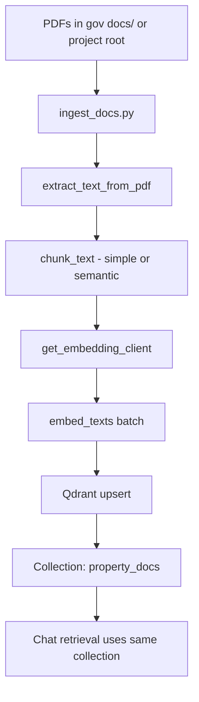
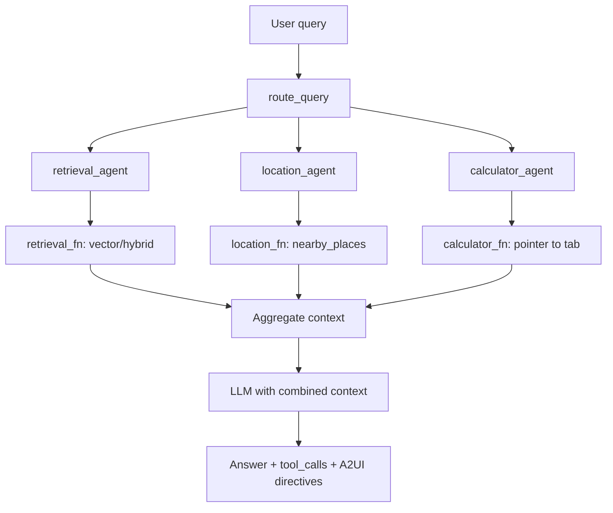

# Architecture & End-to-End Workflow

This document describes the high-level architecture, main components, and end-to-end data flow of the Expat NL Mortgage RAG system. For deployment and operations, see [DEPLOYMENT.md](../DEPLOYMENT.md) and [docs/monitoring.md](monitoring.md).

---

## System overview

---

## Component diagram

---

## End-to-end workflow: Chat (RAG)

---

## End-to-end workflow: Document ingestion

---

## End-to-end workflow: Phase 4 agents (optional)

When “Use Phase 4 agents” is enabled in the sidebar:

---

## Data flow summary

| Flow | Input | Output |
|------|--------|--------|
| **Ingestion** | PDF paths, `.env` (Qdrant, embedding API) | Chunks in Qdrant with `payload.text`, `payload.source` |
| **Chat (RAG)** | User message, sidebar settings | Answer, sources (document + chunk), tools_used |
| **Documents tab** | List: scroll Qdrant. Upload: PDF file | List of sources + chunk counts; new chunks upserted |
| **Observability** | Langfuse (if configured), drift_detection.json | Token/cost, quality/drift indicators in UI |
| **Metrics server** | Separate process: `scripts/metrics_server.py` | Prometheus `/metrics` (counters, latency histograms) |

---

## Key configuration

- **Single entry point**: `app.py` (Streamlit).
- **Vector store**: Qdrant; collection name and dimension from `.env` (`QDRANT_COLLECTION`, `VECTOR_DIMENSION`).
- **LLM/embeddings**: `lib/provider.py`; provider and model from sidebar (driven by `.env` keys and `LLM_MODELS_*` / `OLLAMA_MODELS`).
- **Chunking**: `lib/chunking.py`; ingestion uses `scripts/ingest_docs.py` (simple or `--semantic`); Documents tab upload uses `lib/documents.chunk_text_simple`.

See [DEPLOYMENT.md](../DEPLOYMENT.md) for environment variables and platform notes.
