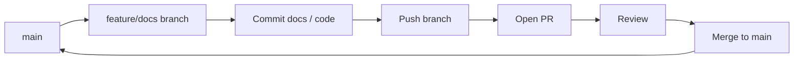

# Contributing – Branching, PRs, and Merge

This document describes how to contribute using **branches and Pull Requests (PRs)** so changes are reviewable and traceable. Doing work in a branch and opening a PR builds trust and keeps main stable.

---

## 1. Workflow overview



---

## 2. Branch strategy

- **`main`**: Stable, deployable state. All merges go through a PR.
- **Feature/docs branches**: Create a branch for your work (e.g. `docs/quickstart`, `feature/refactor-backend`). Do not commit directly to `main` for non-trivial changes.

**Examples**:
- New documentation only: `docs/quickstart`, `docs/architecture`, `docs/prd`.
- Code + docs: `feature/instrument-metrics`, `feature/prompt-injection-checks`.

---

## 3. How to show changes as a PR (step-by-step)

### 3.1 Create a new branch

From project root, with a clean working tree (commit or stash any local changes):

```bash
git checkout main
git pull origin main
git checkout -b docs/quickstart
# Or: git checkout -b feature/your-feature-name
```

### 3.2 Make your changes

- Add or edit files (e.g. under `docs/`).
- **Do not** run or modify existing application code if the task is “documentation only”; if code changes are needed, list them in [CODE_TODO.md](../CODE_TODO.md) or in a separate feature branch.

### 3.3 Commit and push

```bash
git add docs/
git status
git commit -m "docs: add QUICKSTART and ARCHITECTURE with diagrams"
git push -u origin docs/quickstart
```

### 3.4 Open a Pull Request

- Go to the repository on GitHub (or your Git host).
- Create a **Pull Request** from `docs/quickstart` (or your branch) **into `main`**.
- Fill in title and description (e.g. “Add QUICKSTART.md and ARCHITECTURE.md with Mermaid diagrams”).
- Link any related issue or doc (e.g. NotesToImprove, CODE_TODO).

### 3.5 Review and merge

- Reviewers (or you, if you have merge rights) review the PR.
- After approval, **merge** the PR into `main` (merge commit or squash, per team preference).
- Optionally delete the branch after merge.
- Pull latest `main` locally: `git checkout main && git pull origin main`.

---

## 4. Creating a doc in a new branch and merging (summary)

| Step | Action |
|------|--------|
| 1 | Create branch from `main`: `git checkout -b docs/your-doc-name` |
| 2 | Add/edit docs (and/or CODE_TODO for code tasks) |
| 3 | Commit: `git add ... && git commit -m "docs: ..."` |
| 4 | Push: `git push -u origin docs/your-doc-name` |
| 5 | Open PR: branch → `main` |
| 6 | Review and merge to `main` |
| 7 | Update local `main`: `git checkout main && git pull` |

This gives a clear history: “what changed” and “why” are in the PR and commits.

---

## 5. What to put in a PR

- **Title**: Short, descriptive (e.g. `docs: add TROUBLESHOOTING and PRD`).
- **Description**: What was added/changed; link to NotesToImprove or CODE_TODO if relevant.
- **Scope**: If the task was “documentation only”, the PR should not include unrelated code changes; code tasks can be tracked in CODE_TODO and done in a separate PR.

---

## 6. References

- [EXECUTION_SUMMARY.md](EXECUTION_SUMMARY.md) – Execution summary, to-dos, and completed items  
- [CODE_TODO.md](../CODE_TODO.md) – Pending code and refactor tasks  
