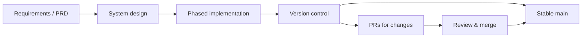

# Design Thinking, System Design, and Version Control

This document captures the **thought process** and **system design** behind the Expat NL Mortgage RAG project and how **version control** is used to support it. No code is modified here; this is documentation only.

---

## 1. Design and version control flow

---

## 2. Thought process and principles

### 2.1 Problem framing
- **Who**: Expat and international buyers in the Netherlands.
- **What**: Reliable, traceable information on Dutch mortgages and property (documents + optional web + calculator + location).
- **Why**: Reduce confusion and increase trust via **citations** and **tools used** visibility.

### 2.2 Design principles
- **Traceability first**: Every answer ties to documents (sources) and tools (vector/hybrid/search).
- **Config over code**: Provider and model from `.env` and sidebar; no hardcoded keys.
- **Incremental delivery**: Four phases (foundation → location/KG → monitoring → multi-agent) so each phase is shippable.
- **Single entry point**: One app (`app.py`) for all tabs to simplify setup and deployment.
- **Reuse over duplication**: Shared `lib/` for retrieval, provider, chunking, agents, location, graph, documents; scripts for ingest and evals.

### 2.3 Trade-offs made
- **Monolithic app**: Fast to iterate and demo; refactor to frontend/backend is a known to-do for production (see [CODE_TODO.md](../CODE_TODO.md)).
- **Keyword-based agent routing**: Simple and predictable; LLM-based routing can be added later.
- **Heuristic RAG evals**: Good enough for a first pass; full pipeline + RAGAS is to-do.
- **In-memory MCP registry**: Demonstrates tool abstraction; real MCP protocol is out of scope for current phase.

---

## 3. System design (high level)

### 3.1 Layers
- **Presentation**: Streamlit (Chat, Calculator, Map, Documents, KG, Observability, Agents).
- **Orchestration**: Chat flow in `app.py` (retrieval → context assembly → LLM → store message/sources); optional orchestrator in `lib/agents.py`.
- **Tools / services**: Retrieval (Qdrant), provider (LLM/embeddings), location (OSRM, Nominatim, Overpass), graph (extraction + PyVis), documents (list/upsert).
- **Data**: Qdrant (vectors + payload), PDFs on disk, optional `data/rag_metrics.json` and golden set.

### 3.2 Data flow (RAG)
User question → sidebar config → retrieval (vector or hybrid) → chunks from Qdrant → optional Tavily → context string → LLM → streamed answer → store (message, sources, tools_used) → render with source tracing.

### 3.3 Extension points
- **New tools**: Register in MCP-style registry or call from orchestrator.
- **New tabs**: Add tab and render function in `app.py`; reuse `lib/` as needed.
- **New providers**: Extend `lib/provider.py` (env + client factory).
- **Evals**: Extend `scripts/run_ragas.py` to run live pipeline and log metrics.

---

## 4. Version control practices

### 4.1 Branching
- **main**: Always in a runnable state; all changes that affect behavior or docs come via PRs when possible.
- **Feature/docs branches**: One branch per logical change (e.g. `docs/quickstart`, `feature/instrument-metrics`). Create from `main`, then open PR back to `main`.

### 4.2 Commits
- **Message**: Short, descriptive (e.g. `docs: add QUICKSTART and ARCHITECTURE`, `fix: session state for use_hybrid`).
- **Scope**: One logical change per PR; keep PRs reviewable (docs-only vs code-only when appropriate).

### 4.3 Pull requests
- **Purpose**: Review, discussion, and a clear record of “what changed and why.”
- **Process**: Create branch → commit → push → open PR to `main` → review → merge. See [CONTRIBUTING.md](CONTRIBUTING.md).

### 4.4 What lives in the repo
- **Code**: `app.py`, `lib/*.py`, `scripts/*.py`, `monitoring/*.py`, `tests/*`.
- **Config**: `.env.example` (no secrets); `.env` is gitignored.
- **Docs**: `README.md`, `DEPLOYMENT.md`, `PHASES.md`, `docs/*.md`, and this file.
- **Data**: `data/golden_rag.json` (and optionally generated `rag_metrics.json`, `ragas_scores.json`); large PDFs or DBs are not committed.

---

## 5. Relating design to version control

- **Phases** (PHASES.md) map to deliverables; each phase can be a set of commits/PRs (e.g. “Phase 1 complete” = ingest, app, tests, CI, deployment docs in main).
- **Design docs** (this file, ARCHITECTURE, PRD) explain the “why”; **version history** (commits/PRs) explains the “when” and “what changed.”
- **CODE_TODO** and **EXECUTION_SUMMARY** track remaining work and completed items so the next contributor or reviewer can see the current state without reading every commit.

---

## 6. References

- [ARCHITECTURE.md](ARCHITECTURE.md) – Components and workflows  
- [PRD.md](PRD.md) – Product and scope  
- [CONTRIBUTING.md](CONTRIBUTING.md) – Branch, PR, merge  
- [CODE_TODO.md](../CODE_TODO.md) – Pending code tasks  
- [EXECUTION_SUMMARY.md](EXECUTION_SUMMARY.md) – Completed and to-do tracking  
