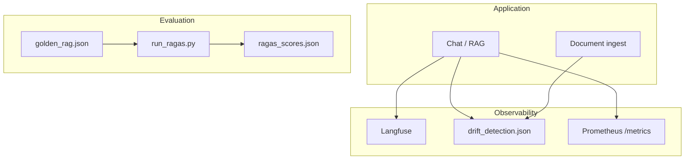
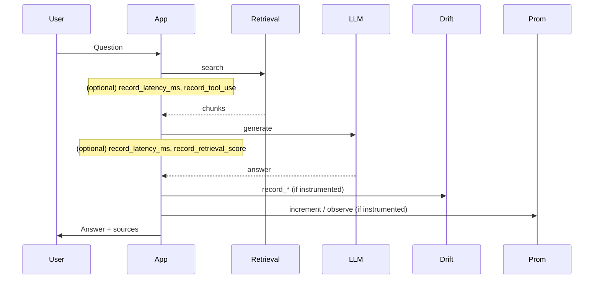

# Monitoring and Evaluation Metrics

This document describes how to monitor the RAG system (latency, errors, usage) and how to run evaluation metrics (e.g. RAGAS-style). For Prometheus/Grafana setup, see also [monitoring.md](monitoring.md).

---

## 1. Monitoring and evaluation overview



---

## 2. Latency and operational metrics

### 2.1 Prometheus metrics (metrics server)

Run the metrics server (separate process):

```bash
python scripts/metrics_server.py
# Or: uvicorn scripts.metrics_server:app --host 0.0.0.0 --port 9090
```

**Endpoints**:
- `GET http://localhost:9090/metrics` – Prometheus scrape
- `GET http://localhost:9090/health` – Health check (FastAPI)

**Metric names** (defined in `scripts/metrics_server.py`):

| Metric | Type | Labels | Description |
|--------|------|--------|-------------|
| `rag_requests_total` | Counter | `tool` | Total RAG requests by tool (e.g. vector_search, hybrid_retrieve) |
| `rag_request_latency_seconds` | Histogram | `tool` | Request latency by tool (buckets: 0.1, 0.25, 0.5, 1, 2.5, 5 s) |
| `rag_errors_total` | Counter | `tool` | Errors by tool |

**Note**: The Streamlit app does not currently increment these metrics. To get real latency and request counts, the app (or a shared middleware) must be instrumented to call the Prometheus client (e.g. `REQUEST_COUNT.labels(tool="vector_search").inc()` and `REQUEST_LATENCY.labels(tool="vector_search").observe(duration)`). See [CODE_TODO.md](../CODE_TODO.md).

### 2.2 Latency you can measure today

- **Langfuse**: If configured, trace LLM calls and see latency per span in the Langfuse UI.
- **Manual**: Add timing in app around retrieval and LLM call; log or display in Observability tab (requires code change; see CODE_TODO).
- **Drift/quality file**: `monitoring/drift_detection.py` writes to `data/rag_metrics.json`; you can record latencies there if you instrument the app to call `record_latency_ms(ms)`.

---

## 3. Quality and drift (Phase 3)

### 3.1 Drift detection module

**File**: `monitoring/drift_detection.py`  
**Persistence**: `data/rag_metrics.json` (configurable via `METRICS_FILE`).

**Functions**:
- `record_retrieval_score(score)` – append to `retrieval_scores` (keep last 99).
- `record_response_score(score)` – append to `response_scores`.
- `record_latency_ms(ms)` – append to `request_latencies_ms` (last 199).
- `record_tool_use(tool_name)` – increment `tool_usage_counts[tool_name]`.
- `get_drift_indicators()` – returns `retrieval_trend`, `response_trend` (e.g. "up" / "stable_or_down") when enough data.
- `get_quality_summary()` – mean retrieval/response quality, p50 latency, tool usage.

**Usage**: The Observability tab can load these via the drift module; for automatic recording, the chat path must call these functions (see CODE_TODO).

### 3.2 Flow: from app to metrics/drift



---

## 4. RAG evaluation (run_ragas.py)

### 4.1 Golden dataset

**File**: `data/golden_rag.json`  
**Format**: List of objects with e.g. `question`, `reference_answer`, `reference_contexts` (or `reference_context`).

### 4.2 Running evals

```bash
python scripts/run_ragas.py
# With custom paths:
python scripts/run_ragas.py --dataset data/golden_rag.json --output data/ragas_scores.json
```

**Current behavior**: Uses heuristics (faithfulness = share of answer words in context; relevancy = overlap with reference answer). Does not call the live retrieval/LLM pipeline unless you extend the script.

**Output**: `data/ragas_scores.json` with `scores` (per question) and `summary` (e.g. `faithfulness_mean`, `answer_relevancy_mean`).

### 4.3 Making evals end-to-end (to-do)

To measure real pipeline quality:
- Run retrieval + LLM for each golden question.
- Compute faithfulness/relevancy (or use RAGAS library) against reference.
- Log to file and optionally expose a metric (e.g. `rag_retrieval_quality`) for Grafana.

See [CODE_TODO.md](../CODE_TODO.md).

---

## 5. Grafana (from monitoring.md)

- Add Prometheus as data source (scrape `http://localhost:9090/metrics`).
- Example panels:
  - **Latency p50**: `histogram_quantile(0.5, rate(rag_request_latency_seconds_bucket[5m]))`
  - **Request rate**: `rate(rag_requests_total[5m])` by `tool`
  - **Errors**: `rate(rag_errors_total[5m])` by `tool`

---

## 6. Summary: what exists vs what needs instrumentation

| Item | Exists | Wired in app? |
|------|--------|----------------|
| Prometheus metric definitions | Yes (`scripts/metrics_server.py`) | No – app does not increment them |
| Metrics server endpoint | Yes | N/A (separate process) |
| Drift/quality file and API | Yes (`monitoring/drift_detection.py`) | Partially (Observability tab reads; recording optional) |
| RAG evals script | Yes (`scripts/run_ragas.py`) | Heuristic-only; no live pipeline run |
| Langfuse | Optional (env) | Yes if callback wired in LLM calls |

For a production-ready setup: instrument the app to record latency and tool use into Prometheus and/or `record_*` in the drift module, and extend RAG evals to run the real pipeline. See [CODE_TODO.md](../CODE_TODO.md).
