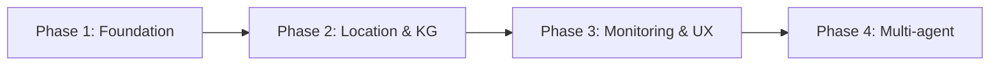

# Product Requirements Document (PRD) – Expat NL Mortgage RAG

**Product**: RAG-based assistant for Dutch mortgages and property (expat-focused).  
**Audience**: Expat and international buyers in the Netherlands.  
**Status**: Implemented in phases (see [PHASES.md](../PHASES.md)).

---

## 1. Vision and goals

### Vision
Provide an AI assistant that helps expats and international buyers understand Dutch mortgages, tax implications, and property-related information using trusted document sources, with clear traceability (sources, tools used) and optional location/mortgage tools.

### Goals
- **Accuracy**: Ground answers in uploaded/official documents; cite sources.
- **Transparency**: Show which tools were used and which documents supported each answer.
- **Usability**: Single app (Chat, Calculator, Map, Documents, KG, Observability) with minimal setup.
- **Extensibility**: Four-phase roadmap from MVP to multi-agent, A2UI, MLOps.

---

## 2. User stories (summary)

| ID | Story | Phase |
|----|--------|-------|
| U1 | As an expat I can ask questions about Dutch mortgages and get answers with document citations. | 1 |
| U2 | As a user I can see which tools (vector search, web search) were used per answer. | 1 |
| U3 | As a user I can use an ING-style mortgage calculator (bid, eigen inleg, energielabel). | 1 |
| U4 | As a user I can toggle web search (Tavily) for up-to-date information. | 1 |
| U5 | As a user I can see nearby facilities (schools, grocery, etc.) and routes (walk/bike/car). | 2 |
| U6 | As a user I can explore a knowledge graph built from text (entities/relations). | 2 |
| U7 | As a user I can view observability (tokens, cost, quality, drift). | 3 |
| U8 | As a user I can upload PDFs and have them ingested into the vector store. | 1 (Documents tab) |
| U9 | As a user I can use an orchestrator that routes to retrieval, location, and calculator specialists. | 4 |

---

## 3. Scope by phase

| Phase | Scope | Key deliverables |
|-------|--------|-------------------|
| **1** | Foundation (MVP) | Single app, RAG + citations, hybrid search, calculator, observability tab, tests, CI, deployment docs |
| **2** | Location & property | Map, nearby_places, OSRM, area_safety, Knowledge Graph tab |
| **3** | Monitoring & UX | Sun-orientation, RAG evals, drift, Prometheus/Grafana |
| **4** | Multi-agent | Orchestrator, specialists, A2UI directives, MCP tool registry |

---

## 4. Functional requirements

### 4.1 Chat (RAG)
- Accept free-text questions.
- Retrieve relevant chunks from Qdrant (vector and/or hybrid with RRF).
- Optionally augment with Tavily web search.
- Generate answers using configured LLM (OpenAI, OpenRouter, Ollama).
- Display per turn: Tools Used, Assistant reply, Source tracing (document + chunk).

### 4.2 Documents
- List documents in the vector store (source name, chunk count).
- Upload PDF; ingest into Qdrant (extract text, chunk, embed, upsert).
- Optional: run KG extraction on uploaded document and show in KG tab.

### 4.3 Mortgage calculator
- Inputs: bid, eigen inleg, type woning, energielabel (A++++ … G, geen label).
- Outputs: Hypotheek, Bruto maandlasten (indicative), Kosten koper (indicative).
- Clearly labeled as indicative; users directed to advisors for real numbers.

### 4.4 Map & location
- Address input; POI categories (e.g. schools, grocery, hospitals); transport mode (walk/bike/car).
- Map with POIs and route/distance; table of facilities.

### 4.5 Knowledge graph
- Text input → entity/relation extraction → PyVis visualization in tab.

### 4.6 Observability
- Token/cost visibility; links to Langfuse when configured.
- Retrieval/response quality and drift indicators (from monitoring/drift_detection and optional RAGAS).

### 4.7 Agents (Phase 4)
- Orchestrator routes query to retrieval, location, calculator specialists.
- Combined context sent to LLM; A2UI directives (e.g. show_calculator, show_map) for UI.

---

## 5. Non-functional requirements

- **Config**: Provider and model selectable via sidebar; driven by `.env` (API keys, URLs).
- **Traceability**: Sources and tools used visible per turn; no hidden context.
- **Deployment**: Documented for local, Streamlit Cloud, HF Spaces, Render; `.env.example` provided.
- **Testing**: Unit tests for retrieval, chunking, calculator; CI (lint + pytest).
- **Security**: No secrets in code; prompt-injection mitigations documented (see [SECURITY_AND_ERROR_HANDLING.md](SECURITY_AND_ERROR_HANDLING.md)); to-do for implementation.

---

## 6. Out of scope (current)

- Legal/financial advice (informational only).
- Real-time mortgage rates from banks (calculator is indicative).
- Full MCP protocol implementation (current MCP is in-memory tool registry).
- Persistent Neo4j KG in app (KG tab uses in-memory extraction + PyVis).

---

## 7. Success criteria

- Phase 1: Ingestion and test_ingestion pass; app runs with Chat, citations, calculator, observability; pytest and CI pass; DEPLOYMENT.md and .env.example exist.
- Phase 2: Map, nearby_places, OSRM, safety, KG tab working; test_phase2 passes when Neo4j/optional checks run.
- Phase 3: Sun widget, observability quality/drift, RAG evals script, /metrics and Grafana documented.
- Phase 4: Orchestrator and specialists invoked from UI; A2UI directives and MCP tools visible.

---

## 8. References

- [PHASES.md](../PHASES.md) – Phase plan and completion tests  
- [ARCHITECTURE.md](ARCHITECTURE.md) – Architecture and workflows  
- [DEPLOYMENT.md](../DEPLOYMENT.md) – Deployment and env vars  
