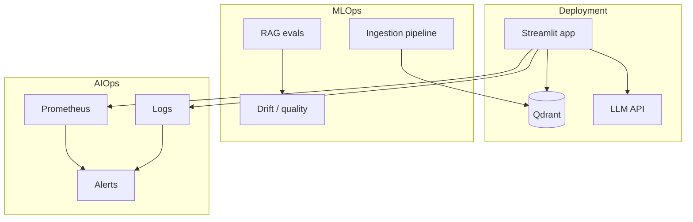

# Production, MLOps, and AIOps

This document describes how to put the Expat NL Mortgage RAG system into **production** and what to do for **MLOps** (model and pipeline operations) and **AIOps** (monitoring, alerting, incident response). It is guidance only; no code is run or modified here.

---

## 1. Production and ops overview

---

## 2. Putting the app in production

### 2.1 Prerequisites
- **Secrets**: All keys (Qdrant, OpenAI/OpenRouter, optional Tavily, Langfuse) in environment or secret store; never in code.
- **Qdrant**: Run as a service (Docker, Kubernetes, or managed Qdrant Cloud) with persistence and backups.
- **Python**: Use a fixed Python version and `requirements.txt` (or lockfile); run in a virtualenv or container.

### 2.2 Deployment options (from DEPLOYMENT.md)
- **Streamlit Community Cloud**: Connect repo, set Secrets, set `QDRANT_URL` (and optional `QDRANT_API_KEY`). Build: `pip install -r requirements.txt`; run: `streamlit run app.py --server.port 8501`.
- **Hugging Face Spaces**: Streamlit SDK; add secrets; use hosted Qdrant or external URL.
- **Render**: Web service; build as above; start: `streamlit run app.py --server.port $PORT --server.address 0.0.0.0`.
- **Self-hosted (Docker/Kubernetes)**: Containerize app + optional Qdrant; expose Streamlit port; configure env from secrets.

### 2.3 Production checklist
- [ ] All secrets from env/secret manager; no `.env` in image.
- [ ] Qdrant has persistence and backup strategy.
- [ ] Health checks: app reachable; Qdrant reachable (e.g. `/collections`); optional `/health` if you add an API.
- [ ] HTTPS and correct CORS/headers if behind a reverse proxy.
- [ ] Rate limiting / abuse protection if public (e.g. at reverse proxy or gateway).
- [ ] Logging: structured logs (e.g. request_id, tool, latency, errors) to stdout or log aggregator.

---

## 3. MLOps (model and pipeline operations)

### 3.1 Ingestion pipeline
- **Script**: `scripts/ingest_docs.py` (and Documents tab upload via `lib/documents.py`).
- **Production**: Run ingestion as a **scheduled or event-driven job** (e.g. when new PDFs land in a bucket). Use the same `QDRANT_COLLECTION`, `CHUNK_SIZE`, `CHUNK_OVERLAP`, and embedding model as the app.
- **Versioning**: Tag document sets or collection names if you need to A/B or roll back (e.g. `property_docs_v2`).
- **Monitoring**: Log ingest duration, chunk count, and failures; alert on repeated failures.

### 3.2 Model and embedding config
- **LLM/embedding**: Driven by `.env` and sidebar; in production, fix provider/model via env (e.g. `LLM_CHOICE`, `EMBEDDING_MODEL`) and restrict or hide sidebar if needed.
- **Drift**: Use `monitoring/drift_detection.py` (and Observability tab) to track retrieval/response quality and latency over time; see [MONITORING_AND_EVALUATION.md](MONITORING_AND_EVALUATION.md). Instrument the app to call `record_*` (see [CODE_TODO.md](../CODE_TODO.md)).

### 3.3 RAG evaluation
- **Offline evals**: Run `scripts/run_ragas.py` on a golden set; extend to run the **live** retrieval+LLM pipeline and log faithfulness/relevancy (see CODE_TODO).
- **CI**: Optionally run a small eval subset in CI and fail on regression (e.g. mean score below threshold).
- **Storing results**: Write to `data/ragas_scores.json` or a blob store; optionally expose a metric (e.g. `rag_retrieval_quality`) for Grafana.

### 3.4 Retraining / re-embedding
- When you add documents or change chunking/embedding model: re-run ingestion (full or incremental by source). Plan for downtime or dual-collection switch if you do full replace.

---

## 4. AIOps (monitoring, alerting, incident response)

### 4.1 Metrics (Prometheus)
- **Server**: `scripts/metrics_server.py` exposes `/metrics`. Run as a sidecar or separate service; scrape with Prometheus.
- **Instrumentation**: The app must be **instrumented** to increment counters and observe latency (see [MONITORING_AND_EVALUATION.md](MONITORING_AND_EVALUATION.md) and CODE_TODO). Until then, metrics may be zero.
- **Key metrics**: Request count and latency by tool (vector_search, hybrid_retrieve, etc.), error count by tool, optional retrieval quality gauge.

### 4.2 Logging
- **Structured logs**: Emit JSON with `request_id`, `tool`, `latency_ms`, `error`, `user_id` (if applicable). Send to a log aggregator (e.g. ELK, Loki, CloudWatch).
- **Sensitive data**: Do not log full prompts or PII; log only IDs and metadata.

### 4.3 Alerting
- **Latency**: Alert if p95 latency for RAG or a tool exceeds a threshold (e.g. 10 s).
- **Errors**: Alert on error rate spike (e.g. `rate(rag_errors_total[5m]) > 0.1`).
- **Availability**: Alert if health checks fail (app or Qdrant down).
- **Quality**: Optional alert if drift or RAGAS score drops below a threshold (when implemented).

### 4.4 Incident response
- **Runbooks**: Document how to restart app/Qdrant, how to roll back ingestion, and how to disable a failing tool (e.g. Tavily) via config.
- **Traceability**: Use Langfuse (or similar) to trace a user session or request when debugging bad answers.
- **Security**: Have a process for prompt injection or abuse (see [SECURITY_AND_ERROR_HANDLING.md](SECURITY_AND_ERROR_HANDLING.md)); log and optionally block or throttle.

---

## 5. Summary

| Area | What to do |
|------|------------|
| **Production** | Deploy app + Qdrant with secrets, health checks, HTTPS, logging; see DEPLOYMENT.md. |
| **MLOps** | Run ingestion as a job; version collections; run RAG evals; track drift; instrument app for quality/latency. |
| **AIOps** | Prometheus + Grafana; structured logs; alerts on latency, errors, availability; runbooks and traceability. |

Code changes required for full instrumentation and evals are listed in [CODE_TODO.md](../CODE_TODO.md).
