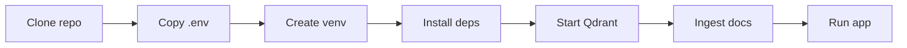

# Quick Start Guide – Expat NL Mortgage RAG

This guide gets you from zero to a running RAG assistant with minimal steps. For architecture and troubleshooting, see [ARCHITECTURE.md](ARCHITECTURE.md) and [TROUBLESHOOTING.md](TROUBLESHOOTING.md).

---

## Prerequisites

- **Python 3.10+**
- **Docker** (optional, for Qdrant)
- **API keys**: OpenAI or OpenRouter (for LLM + embeddings); optional Tavily for web search

---

## Setup Flow



---

## Step-by-step

### 1. Environment

From the **project root** (`expat-nl-mortgage-rag`):

```bash
cp .env.example .env
```

Edit `.env` and set at least:

| Variable | Purpose |
|----------|---------|
| `QDRANT_URL` | Qdrant server (default: `http://localhost:6333`) |
| `QDRANT_COLLECTION` | Collection name (default: `property_docs`) |
| `OPENAI_API_KEY` or `OPENROUTER_API_KEY` | LLM and embeddings |
| `LLM_PROVIDER` | `openai`, `openrouter`, or `ollama` |
| `EMBEDDING_PROVIDER` | `openai` or `openrouter` |

Optional: `TAVILY_API_KEY` (web search), `LANGFUSE_*` (observability).

### 2. Virtual environment and dependencies

```bash
python -m venv venv
# Windows:
venv\Scripts\activate
# Linux/macOS:
# source venv/bin/activate

pip install -r requirements.txt
```

### 3. Start Qdrant

Using Docker (recommended):

```bash
docker run -p 6333:6333 qdrant/qdrant
```

Or use a hosted Qdrant (e.g. qdrant.cloud) and set `QDRANT_URL` (and `QDRANT_API_KEY` if required) in `.env`.

### 4. Ingest documents

```bash
python scripts/ingest_docs.py
```

Expected output: “Found N PDF(s).”, “Upserted M chunks.”, “Done. Total chunks in store: …”

Verify:

```bash
python scripts/test_ingestion.py
```

Expect: `RESULT: PASS`.

### 5. Run the app

```bash
streamlit run app.py
```

Open the URL shown (default: http://localhost:8501). Use the **Chat** tab to ask questions; **Documents** tab to see/upload PDFs; **Mortgage Calculator**, **Map**, **Knowledge Graph**, etc. as needed.

---

## Quick verification checklist

| Step | Command / check |
|------|------------------|
| Env | `.env` exists; required keys set |
| Deps | `pip list \| findstr qdrant` (or `grep` on Linux/macOS) |
| Qdrant | `curl http://localhost:6333/collections` or Docker running |
| Ingest | `python scripts/ingest_docs.py` exit 0 |
| Test ingest | `python scripts/test_ingestion.py` → RESULT: PASS |
| App | `streamlit run app.py` → Chat loads, one question returns answer |

---

## Next steps

- **Full run steps per phase**: [PHASES.md](../PHASES.md)
- **Deployment**: [DEPLOYMENT.md](../DEPLOYMENT.md)
- **Errors and debugging**: [TROUBLESHOOTING.md](TROUBLESHOOTING.md)
