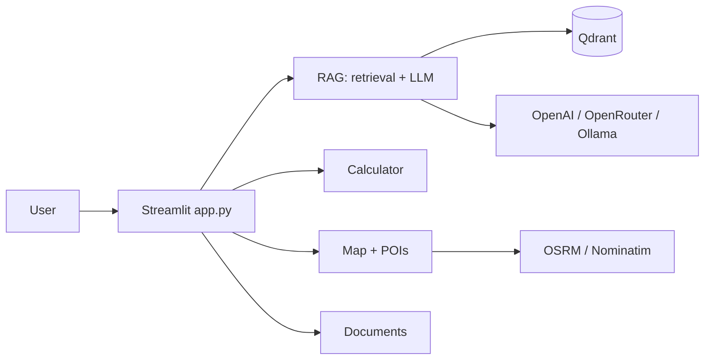

# Expat NL Mortgage RAG – Presentation Report

**Purpose**: High-level report suitable for presentation mode (stakeholders, demos).  
**Details**: See [PRD.md](PRD.md), [ARCHITECTURE.md](ARCHITECTURE.md), [PHASES.md](../PHASES.md).

---

## 1. What we built

A **RAG-based assistant** for Dutch mortgages and property, aimed at expats and international buyers. Users can:

- **Ask questions** and get answers grounded in uploaded documents, with **source tracing** (which document and chunk supported each answer).
- See **which tools were used** per turn (vector search, hybrid search, web search).
- Use an **ING-style mortgage calculator** (bid, eigen inleg, energielabel → indicative Bruto maandlasten, Hypotheek, Kosten koper).
- Explore **nearby facilities** (schools, grocery, etc.) and **routes** (walk/bike/car) on a map.
- **Upload PDFs** and ingest them into the vector store from the app.
- View a **knowledge graph** (entity/relation extraction + PyVis) and **observability** (tokens, cost, quality/drift).

---

## 2. Architecture at a glance

- **Single entry point**: `streamlit run app.py`
- **Vector store**: Qdrant (collection `property_docs` by default)
- **LLM/embeddings**: Configurable (OpenAI, OpenRouter, Ollama for chat)
- **Traceability**: Tools Used + Source tracing per turn

---

## 3. Phases delivered

| Phase | Delivered |
|-------|-----------|
| **1 – Foundation** | Single app, RAG + citations, hybrid search, calculator, observability tab, tests, CI, deployment docs |
| **2 – Location & KG** | Map, nearby_places, OSRM, area_safety, Knowledge Graph tab |
| **3 – Monitoring** | Sun-orientation, RAG evals script, drift detection, Prometheus /metrics server, Grafana notes |
| **4 – Multi-agent** | Orchestrator, specialists (retrieval, location, calculator), A2UI directives, MCP tool registry |

---

## 4. How to run (quick)

1. Copy `.env.example` → `.env`; set Qdrant URL and LLM/embedding API keys.
2. Install deps: `pip install -r requirements.txt`
3. Start Qdrant: `docker run -p 6333:6333 qdrant/qdrant`
4. Ingest: `python scripts/ingest_docs.py` → verify with `python scripts/test_ingestion.py`
5. Run app: `streamlit run app.py`

See [QUICKSTART.md](QUICKSTART.md) and [DEPLOYMENT.md](../DEPLOYMENT.md) for details.

---

## 5. Key metrics and quality

- **Traceability**: Every answer can be traced to documents (Sources expander) and tools (Tools Used).
- **Observability**: Langfuse (optional), drift/quality file, Prometheus metrics server (instrumentation in app is to-do).
- **Evaluation**: Golden dataset + `scripts/run_ragas.py` (heuristic scores); end-to-end pipeline evals are to-do.

---

## 6. What’s next (to-do)

- **Refactor**: Separate frontend and backend (see [CODE_TODO.md](../CODE_TODO.md)).
- **Instrumentation**: Wire latency and tool usage to Prometheus and drift module.
- **Evals**: Run real retrieval+LLM in evals and log quality metrics.
- **Security**: Document and implement prompt-injection handling (see [SECURITY_AND_ERROR_HANDLING.md](SECURITY_AND_ERROR_HANDLING.md) and CODE_TODO).
- **Production / MLOps**: See [PRODUCTION_MLOPS_AIOPS.md](PRODUCTION_MLOPS_AIOPS.md).

---

## 7. References

| Doc | Content |
|-----|---------|
| [README.md](../README.md) | Project overview, quick start, layout |
| [QUICKSTART.md](QUICKSTART.md) | Step-by-step setup with diagram |
| [ARCHITECTURE.md](ARCHITECTURE.md) | Components and end-to-end workflows |
| [PRD.md](PRD.md) | Product requirements and scope |
| [DEPLOYMENT.md](../DEPLOYMENT.md) | Env vars and platform deployment |
| [CODE_TODO.md](../CODE_TODO.md) | Pending code and refactor tasks |
