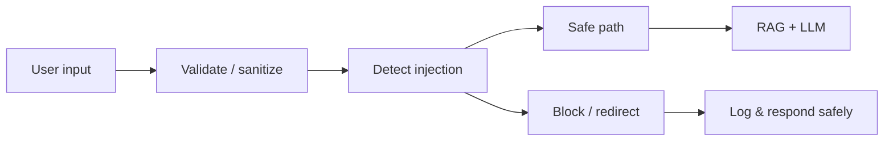

# Security and Error Handling (Including Prompt Injection)

This document describes **security considerations** and **error-handling** approach for the Expat NL Mortgage RAG app, with a focus on **prompt injection**. Implementation of detection and handling is left as a **code to-do** (see [CODE_TODO.md](../CODE_TODO.md)); no application code is modified here.

---

## 1. Security and error-handling overview

---

## 2. Prompt injection – what and why

**Prompt injection** is when a user (or attacker) supplies input designed to make the model follow instructions other than the intended task (e.g. “Ignore previous instructions and …”, or paste of a long adversarial prompt). Risks include:
- Leaking system prompt or context.
- Forcing the model to say something harmful or off-topic.
- Bypassing “answer only from documents” and returning ungrounded or malicious content.

---

## 3. Mitigations (documented; implementation in CODE_TODO)

### 3.1 Prevention and design
- **System prompt**: Keep the system prompt in code/config and do not allow user input to overwrite it. The app already uses a fixed `SYSTEM_PROMPT`; ensure user content is only in the “user” or “assistant” message roles, not in system.
- **Context separation**: Clearly separate “document context” and “user question” in the prompt (e.g. “Context: … Question: …”). The app already does this; avoid concatenating unsanitized user text into the context block.
- **Length limits**: Cap the length of the user message (e.g. 2K–4K characters) to reduce the surface for long adversarial prompts. Not currently enforced; add in code (CODE_TODO).
- **Output constraints**: Instruct the model to answer only from the provided context and to refuse to follow instructions embedded in the user message. The current system prompt says “Use the provided context” and “If the context does not contain enough information, say so”; this can be strengthened (CODE_TODO).

### 3.2 Detection (to implement)
- **Heuristics**: Reject or flag messages that contain known patterns (e.g. “ignore previous instructions”, “system:”, “you are now …”, “disregard …”). Maintain a small blocklist; log and optionally return a generic “I can’t process that request” message.
- **Classifier**: Optionally use a small classifier or LLM-based detector to score “likely injection” and throttle or block. Requires training or prompt-based classification (CODE_TODO).
- **Logging**: Log suspected injections (e.g. pattern match, score) for review and tuning; do not log full user content in production if it may contain PII.

### 3.3 Response and errors
- **On detection**: Do not forward the raw user message to the main RAG/LLM path; return a fixed, safe message (e.g. “I can only answer questions about Dutch mortgages and property. Please rephrase.”) and optionally increment an error/injection metric.
- **On LLM failure**: Catch API errors (rate limit, timeout, content filter); show a user-friendly message and log the error; do not expose stack traces or internal details to the user.

---

## 4. General error handling (current and recommended)

### 4.1 Current behavior
- **Retrieval**: On Qdrant or embedding failure, the app can return empty context and the LLM may answer from general knowledge; tool_calls still reflect what was attempted.
- **Provider**: Missing API key raises `RuntimeError`; the UI shows the error in the chat.
- **Tavily**: Missing key or exception returns empty web context; no crash.
- **Streamlit**: Session state and widget errors are handled by not assigning widget return values to session state for the same key (per existing fix).

### 4.2 Recommended (for implementation)
- **Retrieval failures**: Log error; show “Unable to search documents right now; try again.” and do not send empty context as if it were “no results” (or distinguish “no results” from “error” in the UI).
- **LLM failures**: Catch exceptions from `client.chat.completions.create` and from Ollama; show a short, safe message; log with request_id/trace_id.
- **Validation**: Validate and length-limit user input before calling retrieval/LLM; return a clear message if invalid.
- **Structured errors**: Use a small set of error types (e.g. ValidationError, RetrievalError, LLMError) and map them to user-facing messages and metrics (e.g. `rag_errors_total` by cause).

---

## 5. What is not in scope (current)

- Authentication/authorization (no user accounts in the app).
- Rate limiting per user (can be added at reverse proxy or in app; CODE_TODO).
- PII redaction in logs (recommended for production; CODE_TODO).
- Content safety (e.g. output filter for harmful content); can be added via provider or post-processing.

---

## 6. References and to-do

- **Implementation to-do**: All prompt-injection detection and handling, input validation, length limits, and structured error mapping are listed in [CODE_TODO.md](../CODE_TODO.md).
- **Responsible AI**: [RESPONSIBLE_AI.md](RESPONSIBLE_AI.md) for traceability and transparency.
- **Observability**: [MONITORING_AND_EVALUATION.md](MONITORING_AND_EVALUATION.md) for logging and metrics.
