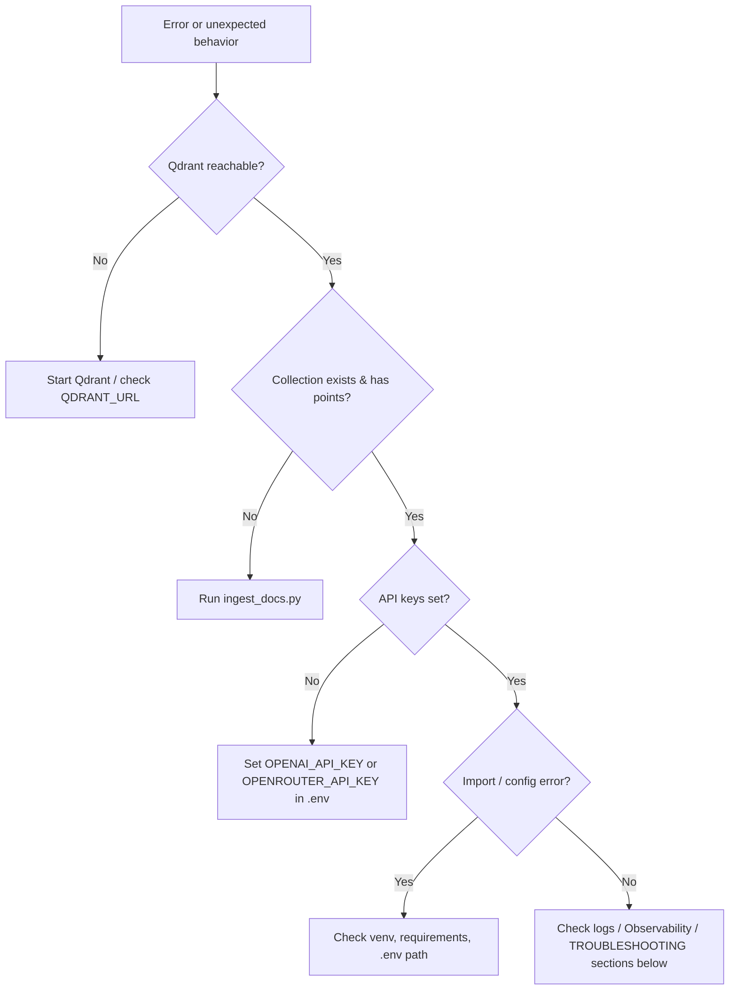

# Usual Errors and How to Debug

This document lists common failure modes and debugging steps for the Expat NL Mortgage RAG project. For setup, see [QUICKSTART.md](QUICKSTART.md); for architecture, see [ARCHITECTURE.md](ARCHITECTURE.md).

---

## Debugging flow (high level)

---

## 1. Qdrant connection errors

**Symptom**: “Connection refused”, “Failed to connect”, or ingestion/app fails when talking to Qdrant.

**Causes**:
- Qdrant not running.
- Wrong `QDRANT_URL` or firewall/network.

**How to debug**:
- Ensure Qdrant is up: `docker ps` (if using Docker), or `curl http://localhost:6333/collections` (adjust host/port from `.env`).
- Confirm `.env` has `QDRANT_URL` (e.g. `http://localhost:6333`). For hosted Qdrant, set `QDRANT_API_KEY` if required.
- Run: `python scripts/test_ingestion.py` — it checks reachability and collection.

**Fix**: Start Qdrant (e.g. `docker run -p 6333:6333 qdrant/qdrant`) or fix URL/key in `.env`.

---

## 2. “No documents in the vector store” / empty retrieval

**Symptom**: Chat says no context found; or test_ingestion reports 0 points.

**Causes**:
- Collection not created or empty (ingestion not run or failed).
- Wrong `QDRANT_COLLECTION` name.
- No PDFs found by `ingest_docs.py` (wrong paths).

**How to debug**:
- Run: `python scripts/ingest_docs.py` and check for “Found N PDF(s)” and “Upserted M chunks”.
- Run: `python scripts/test_ingestion.py` — “Points (chunks) = 0” means nothing was ingested.
- In app: open **Documents** tab; if the list is empty, the store is empty or collection name mismatch.

**Fix**: Add PDFs under `gov docs/` or project root (or pass `--docs-dir`), then run `python scripts/ingest_docs.py`. Ensure `QDRANT_COLLECTION` matches in `.env` and in the app.

---

## 3. LLM / embedding API errors

**Symptom**: “OpenAI requires OPENAI_API_KEY”, “RuntimeError”, or 401/403 from API.

**Causes**:
- Missing or invalid API key in `.env`.
- `LLM_PROVIDER` / `EMBEDDING_PROVIDER` not aligned with the key (e.g. OpenRouter key but provider=openai).

**How to debug**:
- Confirm `.env` has the correct key for the chosen provider: `OPENAI_API_KEY` for openai, `OPENROUTER_API_KEY` for openrouter.
- For Ollama: no key; set `OLLAMA_URL` and ensure Ollama is running. Embeddings still require OpenAI/OpenRouter unless you add another path.
- Run a minimal check: from project root, `python -c "from lib.provider import get_embedding_client; get_embedding_client()"` — should not raise.

**Fix**: Set the right key in `.env` and ensure `LLM_PROVIDER` and `EMBEDDING_PROVIDER` match. For embeddings, OpenAI or OpenRouter must be configured.

---

## 4. Streamlit session state / widget errors

**Symptom**: “Session state could not be modified after widget”, or checkbox/selectbox not reflecting selection.

**Causes**:
- Assigning the return value of a Streamlit widget (e.g. `st.checkbox`) to `st.session_state` for the same key used in the widget.

**How to debug**:
- Check that widgets use `key=...` and that you do not later assign `st.session_state[key] = widget_return_value`. Use a different key for programmatic state, or avoid assigning the widget’s return value to session state.

**Fix**: Use session state only for persistence; let the widget own its key. See existing pattern in app (e.g. `use_hybrid`, `web_search`).

---

## 5. Import errors (e.g. `lib` not found)

**Symptom**: `ModuleNotFoundError: No module named 'lib'` when running scripts or tests.

**Causes**:
- Running from wrong directory (e.g. from `scripts/` without project root in path).
- Virtual environment not activated or different Python.

**How to debug**:
- Run from **project root**: `python scripts/ingest_docs.py`, `pytest`, `streamlit run app.py`.
- Scripts under `scripts/` add project root to `sys.path`; if you run from elsewhere, set `PYTHONPATH` to project root or run from root.

**Fix**: Always run from project root: `cd expat-nl-mortgage-rag` then run commands. Activate the same venv everywhere.

---

## 6. Ingestion: “No PDFs found”

**Symptom**: `ingest_docs.py` exits with “No PDFs found”.

**Causes**:
- Default dirs `gov docs` and `.` have no `.pdf` files, or paths are wrong.

**How to debug**:
- List PDFs: from project root, ensure there are `.pdf` files in `gov docs/` or root.
- Use: `python scripts/ingest_docs.py --docs-dir path/to/folder` (or `--docs-dir path/to/file.pdf`) to point at a specific location.

**Fix**: Add PDFs to the default dirs or pass `--docs-dir` explicitly.

---

## 7. Map / location not loading or wrong POIs

**Symptom**: Map blank, or POIs show wrong category (e.g. “School” for a restaurant).

**Causes**:
- OSRM/Nominatim/Overpass unreachable or rate-limited.
- Category mapping from OSM tags (see `lib/location.py`, `_tags_to_category`) or API response issues.

**How to debug**:
- Check network; try a simple request to OSRM/Nominatim from the same environment.
- In app, try a known address; if map stays blank, check browser console and Streamlit logs for errors.
- For wrong categories: see `lib/map_ui.py` and `lib/location.py` POI category logic.

**Fix**: Ensure external services are reachable; for public OSRM, note that walk/bike may be limited. See [ARCHITECTURE.md](ARCHITECTURE.md) for data flow.

---

## 8. Observability / Langfuse not showing data

**Symptom**: Observability tab empty or no Langfuse traces.

**Causes**:
- Langfuse not configured (`LANGFUSE_*` not set or wrong).
- Callback not invoked (e.g. not wired in the streaming path).

**How to debug**:
- Confirm `.env` has `LANGFUSE_PUBLIC_KEY`, `LANGFUSE_SECRET_KEY`, `LANGFUSE_HOST` (if needed).
- Check Observability tab for links to Langfuse; if links are present but no data, check Langfuse project/dashboard.

**Fix**: Set Langfuse env vars and ensure the app’s LLM calls use the Langfuse callback (see app and provider usage).

---

## 9. Metrics server not receiving data

**Symptom**: Prometheus scrapes `/metrics` but counters/histograms stay at zero.

**Causes**:
- Metrics server is a **separate** process; the Streamlit app does not automatically push to it unless instrumented.
- No code path in the app increments the Prometheus counters/histograms (e.g. `REQUEST_COUNT`, `REQUEST_LATENCY`).

**How to debug**:
- Run `python scripts/metrics_server.py` and open `http://localhost:9090/metrics` — you should see metric names; values may be 0 if the app does not call them.
- Search the app for `REQUEST_COUNT`, `REQUEST_LATENCY`, `ERROR_COUNT` — if not used, metrics will stay zero.

**Fix**: Instrument the app (or a shared middleware) to increment counters and observe latency. See [MONITORING_AND_EVALUATION.md](MONITORING_AND_EVALUATION.md) and [CODE_TODO.md](../CODE_TODO.md).

---

## 10. Tests fail (pytest)

**Symptom**: `pytest` fails (e.g. import, assertion, or test_ingestion Unicode).

**Causes**:
- Running from wrong directory; missing deps; test_ingestion or other scripts assume Qdrant/keys; Windows vs Unix (e.g. arrow character in output).

**How to debug**:
- Run from project root: `pytest tests/`.
- For tests that need Qdrant/API: use env vars or mocks; `test_ingestion.py` may need a running Qdrant.
- Check test file for hardcoded paths or characters that differ on Windows.

**Fix**: Activate venv, install deps, run from root. For integration tests, start Qdrant or use fixtures/mocks. See [PHASES.md](../PHASES.md) for Phase 1 test criteria.

---

## Quick reference: where to look

| Symptom | Likely place | Doc |
|---------|----------------|-----|
| Can’t connect to Qdrant | `QDRANT_URL`, Docker/network | This file §1 |
| Empty retrieval | Ingestion, `QDRANT_COLLECTION` | This file §2, [QUICKSTART.md](QUICKSTART.md) |
| API key / LLM errors | `.env`, `lib/provider.py` | This file §3 |
| Session state / UI glitches | `app.py` widgets and keys | This file §4 |
| Import / path errors | CWD, PYTHONPATH, venv | This file §5 |
| No PDFs ingested | `--docs-dir`, directory layout | This file §6 |
| Map / POI issues | `lib/location.py`, `lib/map_ui.py`, OSRM/Nominatim | This file §7 |
| No Langfuse data | `.env` Langfuse, callback wiring | This file §8 |
| Zero metrics | Instrumentation in app vs metrics_server | This file §9, [MONITORING_AND_EVALUATION.md](MONITORING_AND_EVALUATION.md) |
| Test failures | Root dir, venv, Qdrant, mocks | This file §10 |
