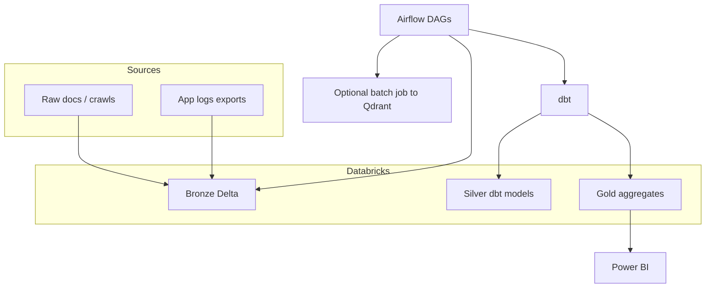

# Plan: Databricks, Airflow, dbt, and Power BI around this project

**Purpose:** Show how a **lakehouse + orchestration + semantic modeling + BI** stack complements the Python RAG app—without replacing the real-time Qdrant/LLM path. **Implementation deferred**; this is integration planning only.

**Related:** [plan-skills-ml-databricks-pyspark.md](plan-skills-ml-databricks-pyspark.md), [plan-reproducible-model-documentation.md](plan-reproducible-model-documentation.md), [plan-production-monitoring-drift.md](plan-production-monitoring-drift.md).

---

## 1. Division of responsibilities

| Tool | Role for expat-nl-mortgage-rag |
|------|--------------------------------|
| **Databricks** | Lakehouse storage (Delta), PySpark/Notebooks for ingest analytics, ML training (reranker, clustering), scheduled jobs, optional **Model Serving** for batch scoring |
| **Airflow** | Orchestrate daily/hourly pipelines: sync sources → transform → embed job → Qdrant refresh → eval → MLflow log |
| **dbt** | SQL transformations on curated tables: `stg_documents`, `dim_source`, `fct_ingest_runs`, `fct_query_logs` (if exported from app) |
| **Power BI** | Dashboards for stakeholders: ingest volumes, eval trends, operational KPIs (latency/error if fed from warehouse) |

The **live chat path** can remain on Docker/FastAPI; the warehouse is **analytical** and **governed**.

---

## 2. Reference data flow

---

## 3. Databricks — concrete uses

| Workload | Description |
|----------|-------------|
| **Document staging** | Land PDF/HTML metadata and extracted text; partition by ingest date |
| **Quality metrics** | Stats on chunk length, language, duplicate URLs before vectors go to Qdrant |
| **ML experiments** | Train sklearn/MLlib reranker; log to MLflow on Databricks or external MLflow |
| **Log analytics** | If you export redacted query events, aggregate for drift dashboards |

**Unity Catalog (if available):** Document PII columns and mask in gold models for Power BI.

---

## 4. Airflow — DAG sketches

1. **`ingest_raw_to_bronze`** — Pull from object storage or scrape output; idempotent partitions.
2. **`run_dbt`** — `dbt run --select tag:daily` on Databricks SQL warehouse or Spark.
3. **`embed_and_upsert`** — Invoke containerized job or Databricks job that runs `scripts/ingest_docs.py` logic against a manifest.
4. **`nightly_eval`** — Run `run_ragas.py` (or Databricks notebook equivalent); post metrics to MLflow and a `fct_eval_runs` table.
5. **`drift_report`** — Aggregate query/retrieval stats vs prior week; alert on threshold.

**Dependencies:** dbt models after bronze refresh; eval after Qdrant refresh completes.

---

## 5. dbt — suggested models

| Layer | Model examples |
|-------|----------------|
| **Staging** | `stg_documents`, `stg_ingest_events` |
| **Intermediate** | `int_document_unique`, `int_chunks_exploded` (if chunk table exists) |
| **Mart** | `mart_ingest_daily`, `mart_eval_timeseries`, `mart_query_volume` |

**Tests:** `unique` on `doc_id`, `not_null` on critical keys, **freshness** on daily tables.

---

## 6. Power BI — dashboard themes

- **Ingest health:** Files processed, failures, p95 processing time.
- **Knowledge base:** Document counts by source/language; last refresh.
- **Quality:** Golden-set scores over time (from `mart_eval_timeseries`).
- **Ops (if wired):** Error rate and latency from exported metrics tables—not live Prometheus unless you ETL it.

**Gateway:** On-prem or VNet data gateway to Databricks SQL / warehouse connection.

---

## 7. Phased adoption (plan → implement → test)

### Phase 1 — Minimal viable warehouse

- Export static CSV/Parquet from current `data/` + manual eval results into Delta **or** start with one notebook producing a single `mart_eval_timeseries`.

**Test:** Power BI connects and refreshes.

### Phase 2 — Airflow schedules dbt

- Move SQL out of notebooks into dbt; Airflow triggers `dbt build`.

**Test:** Failed dbt test blocks downstream embed DAG task (alert).

### Phase 3 — Close the loop to RAG

- Manifest-driven Qdrant refresh from gold table of approved documents.

**Test:** Staging Qdrant collection matches row counts within tolerance.

---

## 8. Cost and scope discipline (portfolio projects)

- Use **serverless SQL** or small clusters on a schedule; shut down when idle.
- One **dev** workspace is enough to demonstrate the pattern; document assumptions instead of over-automating.

---

## 9. Repo relationship (no code in this phase)

Keep application code in **this Git repo**; store **infra-as-code** for Databricks/Airflow/dbt in a separate repo or `infra/` folder **when you implement**, with clear README links from the main project.
