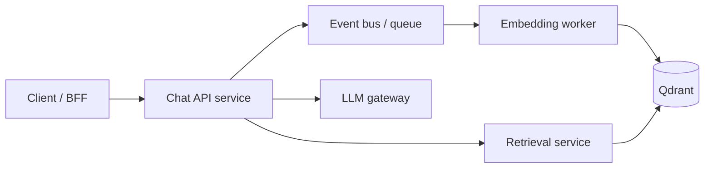

# Plan (later): Event-driven architecture and ML as microservices

**Scope:** Roadmap for evolving this project toward **event-driven** flows and **ML/RAG components served as separate services**. **Explicitly later:** implement and test only after the synchronous API and monitoring baselines are stable ([plan-ml-realtime-deployment.md](plan-ml-realtime-deployment.md), [plan-production-monitoring-drift.md](plan-production-monitoring-drift.md)).

**Related:** [plan-databricks-airflow-dbt-powerbi.md](plan-databricks-airflow-dbt-powerbi.md).

---

## 1. Motivation

| Driver | Benefit |
|--------|---------|
| Scale retrieval/embed workers independently | Burst ingest without slowing chat API |
| Decouple providers | Swap embedding or LLM vendor with smaller blast radius |
| Async workloads | Long doc ingest, batch eval, re-embedding on model upgrade |

---

## 2. Target logical architecture (future state)

Variations: **one** FastAPI monolith calling Qdrant directly (simpler) vs **retrieval microservice** that only exposes `POST /search`.

---

## 3. Event-driven use cases for this RAG project

| Event | Producer | Consumers | Payload sketch |
|-------|----------|-----------|----------------|
| `document.uploaded` | Admin UI or Airflow | Ingest worker | `doc_id`, `uri`, checksum |
| `ingest.completed` | Ingest worker | Notify API cache invalidation | `collection`, `version` |
| `query.executed` | API (async fan-out) | Analytics, drift aggregator | Redacted query features |
| `eval.scheduled` | Cron / Airflow | Eval worker | `git_sha`, `variant` |
| `model.promoted` | MLflow / CI | Deploy pipeline | `model_version`, image tag |

Technology choices (when implementing): **Kafka**, **Redis Streams**, **RabbitMQ**, or cloud-native queues—pick one and document operational cost for a learning project.

---

## 4. Microservices boundaries (suggested splits)

1. **API / orchestration** — Auth, session, calls retrieval + LLM, returns citations.
2. **Retrieval service** — Embed query (or accept vector), hybrid search, return ranked chunks (internal network only).
3. **Ingestion service** — Chunk, embed, upsert; heavy CPU/I/O.
4. **Optional reranker service** — Small GPU or CPU model; strict timeout.

**Principle:** Keep **orchestration state** in one place; make leaf services stateless where possible.

---

## 5. Phased plan (later: plan → implement → test)

### Phase L1 — Stay synchronous; define interfaces

- Internal Python protocols or OpenAPI for `retrieve(query) -> chunks` even inside monolith.
- Document message schemas **on paper** before picking a broker.

**Test:** Swap in a mock retrieval client; API tests still pass.

### Phase L2 — Extract retrieval service

- Same Docker network; gRPC or REST; mTLS or network policies in real prod.

**Test:** Contract tests + load test retrieval alone.

### Phase L3 — Add queue for ingest

- Producer: `scripts/ingest_docs.py` or upload endpoint enqueues jobs.
- Consumer: worker processes jobs idempotently (`doc_id` dedupe).

**Test:** Chaos: kill worker mid-job; verify retry and no duplicate points (use deterministic ids).

### Phase L4 — Event-driven observability

- Correlation id across events; span per stage in traces.

**Test:** End-to-end trace shows ingest → available in search within SLO.

---

## 6. Operational concerns (checklist)

- **Idempotency** — Replays must not corrupt Qdrant.
- **Ordering** — Per-document serialization; global order rarely needed.
- **DLQ** — Dead-letter queue for failed embeds with alert.
- **Schema evolution** — Version event payloads.

---

## 7. When *not* to do this yet

- If team size is one and traffic is low, **monolith + good modular boundaries** beats premature microservices.
- Revisit after FastAPI product path and Prometheus wiring are done ([langgraph-rag-mlflow-fastapi-build-test-monitor-deploy.md](langgraph-rag-mlflow-fastapi-build-test-monitor-deploy.md)).
